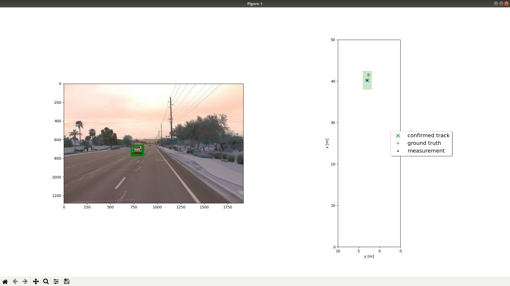
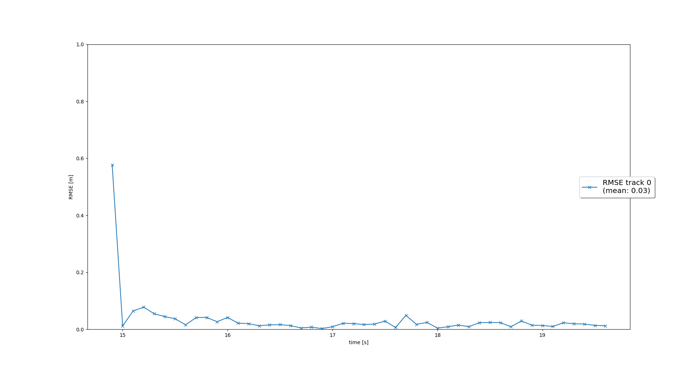
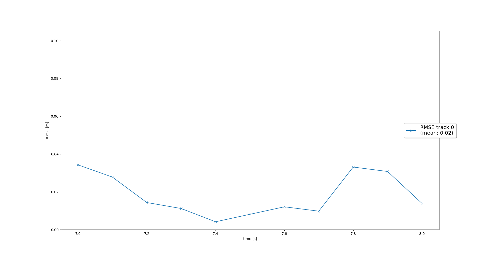
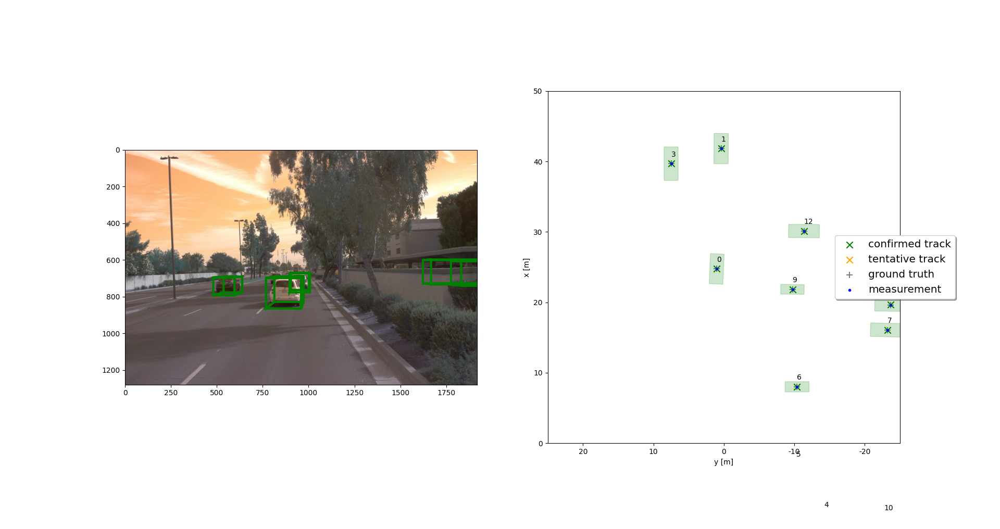
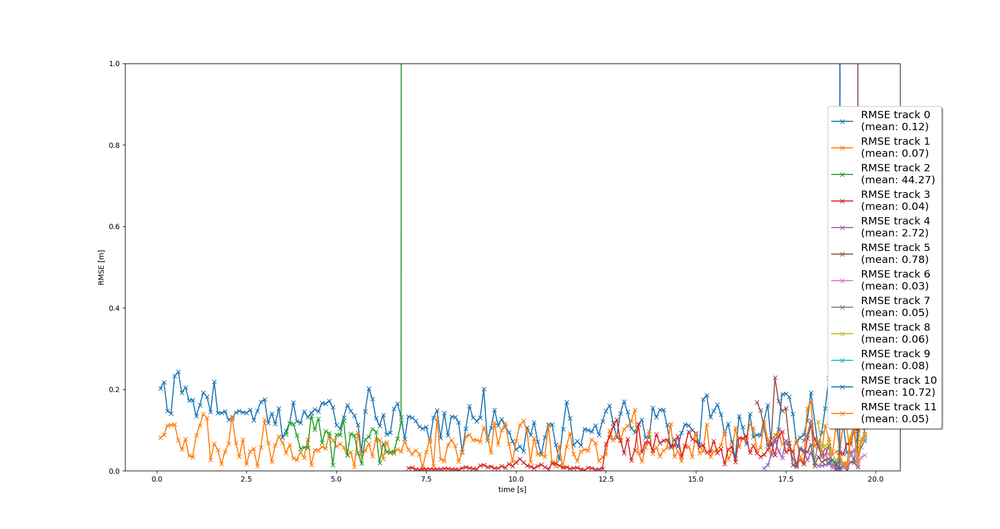

# Writeup: Project: Sensor Fusion and Object Detection
The final project consists of four main steps:

- Step 1: Implement an extended Kalman filter.
- Step 2: Implement track management including track state and track score, track initialization and deletion.
- Step 3: Implement single nearest neighbour data association and gating.
- Step 4: Apply sensor fusion by implementing the nonlinear camera measurement model and a sensor visibility check.

Since the final project is based on the mid-term project, same code files are used as in the mid-term.

## Question Session

### 1. Write a short recap of the four tracking steps and what you implemented there (filter, track management, association, camera fusion). Which results did you achieve? Which part of the project was most difficult for you to complete, and why?

#### Step 1: Extended Kalman Filter (EKF)

To implement an Extended Kalman Filter (EFK), the 6 dimensional system states [x, y, z, vx, vy, vz], process noise Q for constant velocity motion model are designed. To update the current state calculation, h(x) and the Jacobian H are calculated. In the first step, the EKF is applied to simple single-target scenario with lidar only. This is shown in the below figure.

To evaluate the tracking performance, the mean of root mean squared error (RMSE) is calculated. As depicted, the mean RMSE results are smaller than the given reference value 0.35. 

#### Step 2: Track Management
In the second step, the track management is implemented to initialize and delete tracks, set a track state and a track score. First, the track is initialized with unassigned lidar calculation and decrease the track score for unassigned tracks. Then tracks are deleted if the score is too low or P is too big. The below figure shows the single track without track losses in between. 

#### Step 3: Data Association
In the data association, the closest neighbor association matches measurements to tracks and decides which track to update with which measurement by using the Mahalanobis Distance (MHD). The MHD measures the distance between a point and a distribution. The MHD is used to exclude unlikely track pairs by comparing threshold which is created based on the chi-squared distribution. The following figures show the data association results and corresponding rmse results.

#### Step 4: Sensor Fusion
To complete the sensor fusion system, the camera measurements including covariance matrix R are implemented. Therby, the function of ``Sensor`` class called ``in_fov()`` is implemented to check if the input state vector of an object can be seen by this sensor. Here, we have to transform from vehicle to sensor coordinates. Furthermore, a nonlinear camera measurement model h(x) is implemented.

As shown in the gif, tracking vehicles with sensor fusion system are shown.

In this figure, we see a peak of track 2. In the above figure, we can see at the beginning that the vehicle 2 is out of FOV and we lose the corresponding measurements. Therefore the mean RMSE of track 2 increases respectively.

### 2. Do you see any benefits in camera-lidar fusion compared to lidar-only tracking (in theory and in your concrete results)? 

### 3. Which challenges will a sensor fusion system face in real-life scenarios? Did you see any of these challenges in the project?

### 4. Can you think of ways to improve your tracking results in the future?
